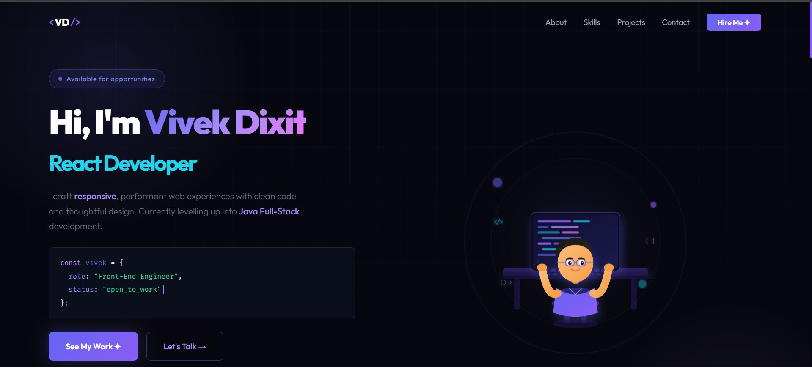
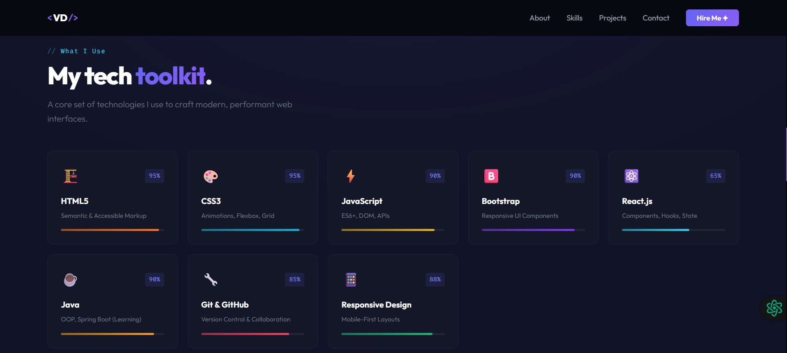

# 🚀 Vivek Dixit — Portfolio (Vite + React)

<div align="center">



**A modern, animated front-end developer portfolio built with React + Vite.**
Blue & Purple theme • 3D SVG illustrations • Fully responsive • Live contact form

[🌐 Live Demo](#) · [📧 Contact](mailto:dixitvivek857@gmail.com) 

</div>

--- 

## 📸 Screenshots

### 🏠 Hero Section


### 🛠️ Skills Section


---

## ✨ Features

- ⚛️ **React 18** — Component-based architecture with hooks
- ⚡ **Vite 5** — Lightning fast dev server & build tool
- 🎨 **CSS Modules** — Scoped, maintainable styles
- 📱 **Fully Responsive** — Mobile-first design with slide-in hamburger menu
- 🎭 **3D SVG Illustrations** — Custom animated developer characters
- 🖼️ **Real Photo** — Personal photo in Hero section with purple glow frame
- 💌 **Live Contact Form** — Powered by Formspree (emails sent to Gmail)
- 🔠 **Animated Role Switcher** — Cycles through: Front-End Engineer → React Developer → UI Craftsman → Full-Stack Trainee
- 📊 **Skill Progress Bars** — Scroll-triggered fill animations
- 🌀 **Scroll Reveal** — Sections fade up as you scroll
- 💜 **Blue & Purple Theme** — Cohesive design system with CSS variables
- 🔤 **Custom Fonts** — Outfit + Fira Code from Google Fonts
- 💜 **VD Favicon** — Custom branded tab icon

---

## 🗂️ Project Structure

```
vivek-portfolio-vite/
├── public/
│   ├── vivek.jpeg            ← Your profile photo
│   ├── favicon.svg           ← VD logo favicon
│   ├── preview-hero.png      ← README screenshot
│   ├── preview-skills.png    ← README screenshot
│   └── robots.txt
├── src/
│   ├── components/
│   │   ├── Navbar.jsx / .module.css
│   │   ├── Hero.jsx / .module.css
│   │   ├── About.jsx / .module.css
│   │   ├── Skills.jsx / .module.css
│   │   ├── Projects.jsx / .module.css
│   │   ├── Contact.jsx / .module.css
│   │   ├── Footer.jsx / .module.css
│   │   ├── Developer3D.jsx
│   │   └── Developer3DAbout.jsx
│   ├── styles/
│   │   └── global.css
│   ├── App.jsx
│   └── main.jsx
├── index.html
├── vite.config.js
├── package.json
└── README.md
```

---


### Prerequisites
- Node.js v16 or above

### Installation & Run

```bash
# 1. Install dependencies
npm install

# 2. Start dev server
npm run dev
```


### Build for Production
```bash
npm run build
npm run preview
```

## 📁 Project Structure

```
vivek-portfolio/
├── index.html
├── vite.config.js
├── package.json
├── src/
│   ├── main.jsx
│   ├── App.jsx
│   ├── styles/
│   │   └── global.css
│   └── components/
│       ├── Navbar.jsx / .module.css
│       ├── Hero.jsx / .module.css
│       ├── About.jsx / .module.css
│       ├── Skills.jsx / .module.css
│       ├── Projects.jsx / .module.css
│       ├── Contact.jsx / .module.css
│       ├── Footer.jsx / .module.css
│       ├── Developer3D.jsx       ← 3D SVG Hero illustration
│       └── Developer3DAbout.jsx  ← 3D SVG About illustration
```

## ✏️ Customization

- **Colors** → `src/styles/global.css` (CSS variables)
- **Projects** → `src/components/Projects.jsx` (projects array)
- **Skills** → `src/components/Skills.jsx` (skills array)
- **Contact** → `src/components/Contact.jsx` (contacts array)

## 🛠 Tech Stack

- **Vite 5** — Fast build tool (replaces Create React App)
- **React 18** — UI framework
- **CSS Modules** — Scoped styling
- **Google Fonts** — Outfit + Fira Code

---

## 🚀 Getting Started

### Prerequisites
- **Node.js** v16 or above

### Run Locally

```bash
# Install dependencies
npm install

# Start dev server
npm run dev
```

Open **http://localhost:5173** 🎉

### Build for Production

```bash
npm run build
npm run preview
```

---

## 🛠️ Tech Stack

| Technology | Purpose |
|-----------|---------|
| React 18 | UI framework |
| Vite 5 | Build tool & dev server |
| CSS Modules | Scoped component styling |
| Google Fonts | Outfit + Fira Code typography |
| Formspree | Contact form email delivery |
| SVG Animations | 3D developer illustrations |
| Intersection Observer API | Scroll-triggered animations |

---

## 📋 Sections

| Section | Description |
|---------|-------------|
| **Hero** | Animated headline, role switcher, real photo, code snippet |
| **About** | Bio, 3D illustration, traits, education badges |
| **Skills** | 8 skill cards with animated progress bars |
| **Projects** | 3 featured projects with tech tags & links |
| **Contact** | Formspree-powered form + contact info |
| **Footer** | Links to GitHub, LinkedIn, Email |

---

## ✏️ Customization

| What to change | File |
|----------------|------|
| Colors & theme | `src/styles/global.css` |
| Your photo | Replace `public/vivek.jpeg` |
| Projects | `src/components/Projects.jsx` |
| Skills | `src/components/Skills.jsx` |
| Contact form | `src/components/Contact.jsx` |
| Social links | `src/components/Footer.jsx` |

---

```js
await fetch('https://formspree.io/f/YOUR_FORM_ID', { ... })
```

---

## 📄 License

---

<div align="center">

Made with 💜 by **Vivek Dixit**

[dixitvivek857@gmail.com](mailto:dixitvivek857@gmail.com) · [GitHub](https://github.com/vivekDixit52) · [LinkedIn](https://www.linkedin.com/in/vivek-dixit-88a652237/)

</div>

